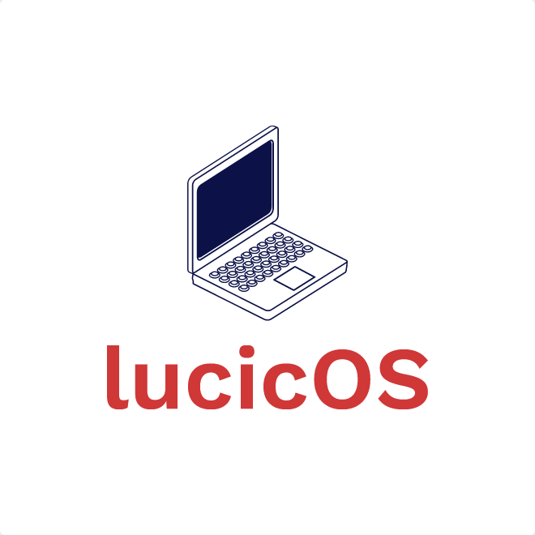
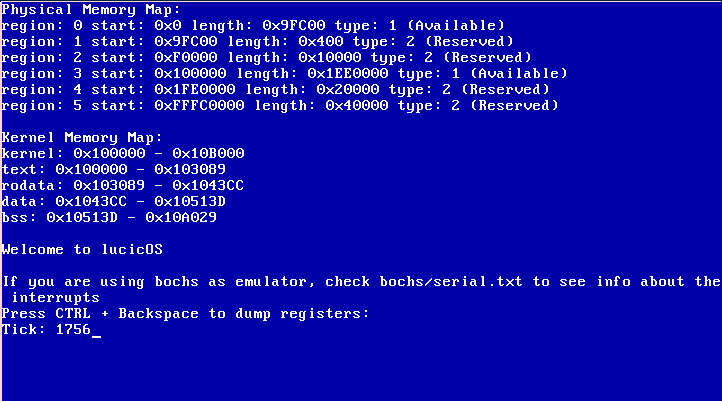

# lucicOS

lucicOS is an educational, UNIX-like operating system built from scratch using
the following resources:
  * [OSdev](https://wiki.osdev.org/Expanded_Main_Page)
  * [Little OS Book](https://littleosbook.github.io/)
  * [JamesM kernel development tutorial](http://www.jamesmolloy.co.uk/tutorial_html/)
  * [Intel manuals](http://web.eecs.umich.edu/~farnam/482/Winter99/intarch.html)
  * [BrokenThron](http://www.brokenthorn.com/Resources/OSDevIndex.html)

At the moment it is not aimed to be portable or support multiple architectures.
It is just my attempt to learn some important concepts about operating systems
and develop my coding techniques.

It only supports x86 architecture.

## Building the project

It can be built using the following command: `./build.sh`. To run the OS in
bochs, just run `./bochs.sh`, the same applies to qemu, just run `./qemu.sh`.

For building, running and testing, I use the following tools:
  * i686-elf-gcc (GCC) 8.2.0
  * GNU ld (GNU Binutils) 2.31.1
  * GNU ar (GNU Binutils) 2.31.1
  * QEMU emulator version 2.11.
  * Bochs ??

## Screenshots

## Features

At this moment there is still a lot of work to do in order to call this a real
Operating System. 
These are some features that I managed to understand and implement:
  * VGA (writing on screen)
  * Serial (writing on serial ports)
  * Keyboard (reading characters/shortcuts from keyboard)
  * Timer (Receiving data from Programmable Interval Timer)
  * Physical and Virtual Memory Mangers
  * Interrupt request and Interrupt Service Routines
  * Global Descriptor Table and Protected Mode

What I am currently working at:
  * Moving the kernel in the Higher Half
  * Writing a consistent Page Allocator
  * Making a tutorial out of this project

## License

This project is licensed under BSD-2-Clause License.

## Notes

The only supported architecture is x86 because it has the richest documentation
and all the tutorials on the internet are x86 oriented.

I am still struggling to find an optimal project structure that can help me
build this project faster and easier, currently I am trying different
structures found on the internet or designed by myself.
